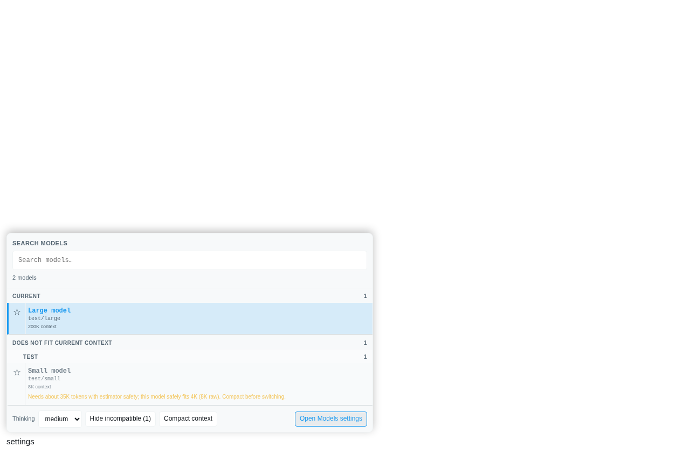
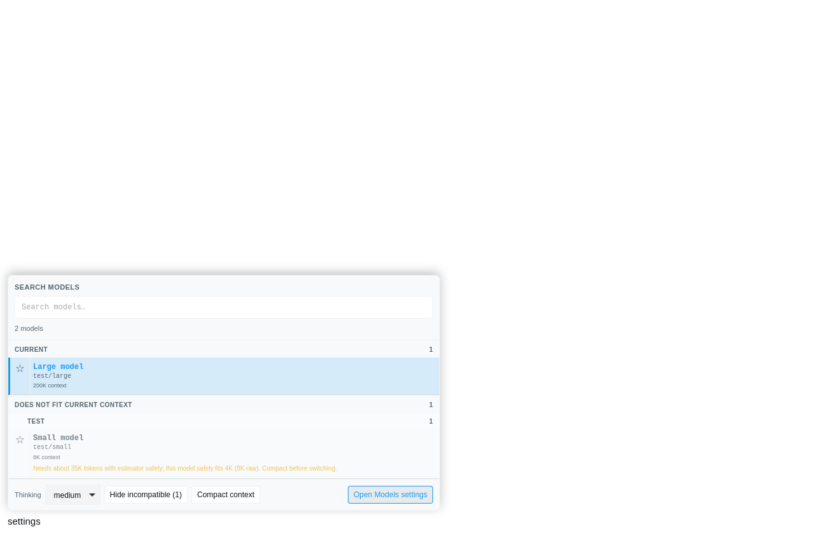
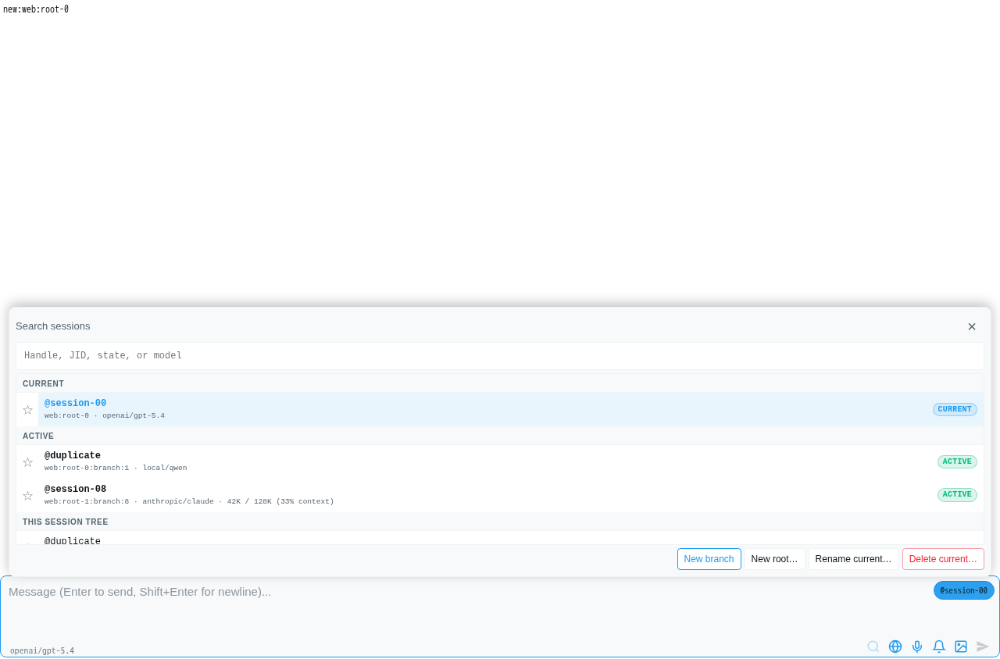
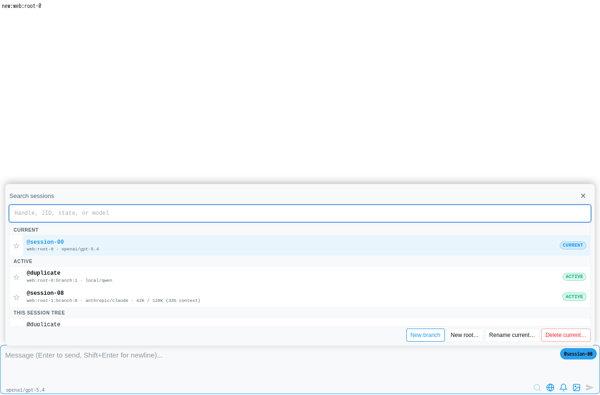

# Model and session picker button parity

Picker action buttons used browser-default fonts: Chromium computed `Arial`, while WebKit computed `-webkit-standard`. Both differed from the surrounding skin. The Classic model footer also stretched its buttons to the native thinking-select height, which differed between engines.

## Change

- Scope native-appearance, margin, box-sizing and font resets to model/session popup buttons.
- Use each skin's UI font, 12px text with 15px line-height, explicit borders/padding and 28px desktop action targets. Retain 44px phone targets.
- Centre icon controls explicitly and align the Classic thinking select without stretching adjacent buttons.
- Give model/session actions consistent hover, disabled and visible keyboard-focus states. Let Classic session actions wrap on narrow screens.
- Preserve skin colours, list-row presentation and picker handlers. No global button reset, settings redesign, session/model semantics or production reload.

## Verification — 18 September 2026

- The new browser test failed on the old CSS in all four engine/skin desktop combinations because the computed button font did not match the skin.
- New matrix: 16 passing cases, each covering both model and session pickers — Chromium/WebKit × Classic/Visual × 1280/390px × dark/light. Checks cover computed font/appearance, line-height, border/box model, target height, viewport bounds, keyboard focus, disabled state, model filtering/settings and Classic session actions.
- Existing session-picker browser tests: 3 passed, including pins, search, keyboard selection, Escape focus return, tablet geometry and archived entries. Combined: 19 browser tests, 1,275 assertions.
- Focused unit/source contracts: 43 passed.
- `make ci-fast`: passed end-to-end — 5,390 runtime tests passed, 4 skipped; 25 feature tests and 9 build tests passed.
- All typechecks, changed-test lint, environment inventory, pack hygiene, stale-dist and test-entrypoint checks passed.
- First broad run timed out in the unrelated isolated SQLite terminal-settlement contract while browser tests ran concurrently. That file passed all 50 tests alone; the full sequential rerun then passed. No timeout or database code was changed.

Tests use disposable local servers and real picker components. WebKit on Linux and Chromium touch emulation cover engine differences; no physical iOS/macOS/Windows device was tested. Font rasterisation and available system fonts may still differ by platform.

## Captures

| Chromium | WebKit |
|---|---|
|  |  |
|  |  |

Browser tests: `runtime/test/web/picker-buttons.playwright.optional.test.ts` and `session-picker-alignment.playwright.optional.test.ts`. Run through `test:local` with `PICLAW_RUN_OPTIONAL_BROWSER_TESTS=1` and a Playwright browser cache. The new test writes the full 32-capture matrix to `.artifacts/picker-buttons/` under the repository root.
