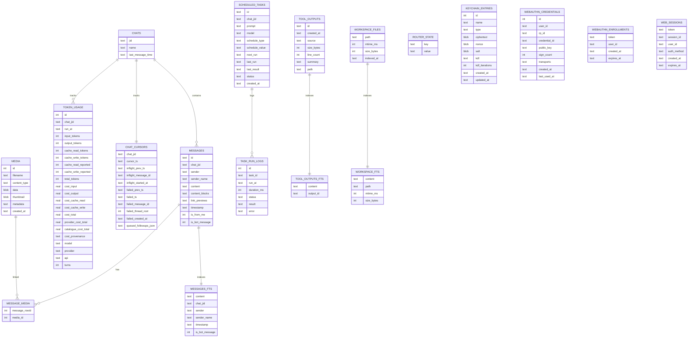

# Storage model

`piclaw` stores state in SQLite at `/workspace/.piclaw/store/messages.db`. The database is the source of truth for chat history, media, tasks, token usage, account/factor records and session ownership. Additive multi-user tables do not enable a multi-user deployment: [startup still permits only single-user mode](multi-user/README.md).

**Never delete this file.** Only repair or migrate it.

## Key tables

| Table | Purpose |
|-------|---------|
| `chats` | Known chat JIDs and metadata |
| `messages` | Message history |
| `messages_fts` | Full‑text search index |
| `media` | Attachment blobs |
| `message_media` | Message ↔ media join |
| `scheduled_tasks` | Task definitions |
| `family_scheduled_grants` | Immutable owner/initiating-user/service, exact task revision/payload and branch binding, issued tool ceiling and non-secret login correlation; prepared tasks stay paused |
| `family_scheduled_grant_revocations` | Append-only owner/account/task revocation; disable/role changes, task edits and deletion cannot resurrect prior grants |
| `family_scheduled_occurrences` | One internal reservation per grant, due-time/worker/attempt/version fence and hashed expiring lease; consumed reservations cannot replay |
| `family_scheduled_occurrence_events` | Append-only claim/reclaim/renew/consume audit without prompts or lease tokens |
| `family_scheduled_executions` | Immutable consumed-occurrence handoff, owner/service/target and label snapshot, prompt hash, tool ceiling and hashed 15-minute settlement capability |
| `family_scheduled_results` | One immutable bounded text result per execution; exact retries acknowledge the same record |
| `family_scheduled_execution_events` | Append-only begin/settle audit, committed with the corresponding state |
| `family_scheduled_dispatches` | Immutable one-start-per-handoff admission receipt; no capability token and no automatic retry |
| `family_scheduled_publications` | Immutable owner-confirmed publication receipt binding execution, original chat and exact message row/hash; prevents replay or recreation |
| `task_run_logs` | Task run history |
| `token_usage` | Per‑assistant‑message token + cost usage (includes model/provider/api for per‑model tracking) |
| `tool_outputs` | Stored tool output summaries |
| `tool_outputs_fts` | Full‑text index for tool output |
| `workspace_files` | Indexed workspace files (path, size, mtime) |
| `workspace_fts` | Full‑text index for workspace content |
| `chat_cursors` | Per‑chat cursor + inflight/failed run tracking + deferred follow‑up queue |
| `router_state` | Misc router state (auto‑compaction + web status) |
| `keychain_entries` | Encrypted secrets for tool env injection |
| `webauthn_credentials` | Independent passkeys per user/RP (credential public keys + counters); multiple keys per account and optional owner-authored label |
| `webauthn_enrollments` | Legacy single-user passkey enrolment tokens |
| `web_sessions` | Hashed bearer tokens, non-secret `session_id`, user ID, auth method, expiry and optional owner-authored login label |
| `chat_branches` | Stable branch/chat/root/parent IDs, friendly handle and explicit owner-handle namespace |
| `users` | Immutable account ID, normalised username, display name, role, enabled state and home |
| `access_state` | Activated access mode and access schema version; protects against configuration loss/downgrade |
| `session_roots` | Immutable owner and private policy for a stable root branch |
| `owned_fork_operations` | Owner/source/idempotency binding and captured JSON seed, committed with the child; `adopted_jsonl` migration seeds retain exact hash-checked child history until SDK import/persist/reopen; seed cleared only after persistence |
| `message_execution_authorities` | Immutable admitted message/actor/owner/login IDs, content hash, thread and owner-local request key; no bearer token |
| `message_recovery_authorities` | Append-only explicit retry/skip records with owner, input row ID, replacement login ID and idempotency key; original admission stays unchanged |
| `migration_input_holds` | Copy-time owner/message/timestamp/content-hash holds for legacy unconsumed inputs; no login or executable admission; original messages remain unchanged |
| `migration_input_dismissals` | Owner/recent-login/request-ID dismissal audit for the oldest held legacy input; row-specific dequeue filtering, no timestamp cursor advance or prompt execution |
| `user_totp_factors` | Encrypted per-user TOTP seed, revision and last-used timestep; separate from keychain injection |
| `user_totp_enrolments` | Hashed confirmation token, encrypted pending seed, attempt count and expiry |
| `user_totp_registrations` | Self-service TOTP reservation bound to user, login and Origin; hashed token and five-minute expiry. Login deletion removes matching pending ciphertext through triggers |
| `user_auth_invitations` | Hashed invitation/browser/enrolment tokens, target/issuer, origin and expiry; explicit TOTP/passkey method, passkey RP/challenge; consumed proof retains grant until commit/expiry so revocation still wins |
| `user_passkey_registrations` | Hashed ceremony token bound to user, login, RP, origin, challenge and expiry |
| `user_auth_attempts` | Hashed account/client rate-limit buckets and reset time |
| `account_recovery_events` | Non-secret actor/target/reset event/time audit |
| `operator_recovery_events` | Offline recovery audit: ID, target administrator, selected factor method, exact HTTPS origin and time; no token, seed or synthetic user actor |
| `access_migration_preparation` | Present only in a copy prepared by the offline migration command; source snapshot/time and ownership-only stage; its presence blocks current access-state reads/startup, without changing activation |
| `access_resource_migration` | Version-three prepared-copy policy, source fingerprint, count-only disposition report and timestamp; no source mutation or activation |
| `access_factor_migration` | Version-four factor policy, source fingerprint, preserved passkey/TOTP counts, default-import flag and time; never seed/code material; existing confirmed records unchanged |
| `migration_media_quarantine` | Prepared-copy media IDs with unlinked/unresolved-link/multiple-owner reason; bytes remain stored but family media access denies these IDs, including newly added links |
| `account_security_events` | Administrative device/factor revocation audit: acting admin, target account, item kind/non-secret ID and time; committed with the revocation |
| `account_home_events` | Administrative home-change audit: actor/target, previous home JID, new owned root branch ID and time; committed with the default change |
| `user_tool_restrictions` | Per-account denied names within the fixed family ceiling and optimistic-concurrency revision |
| `user_tool_restriction_events` | Acting administrator, target, old/new denial lists, revision and time; committed atomically with policy changes |
| `user_preferences` | Immutable-account-ID appearance and bounded response guidance, revision and update time; owner-only API, no global Settings or memory-file writes |
| `user_avatars` | Immutable-account-ID 256-pixel WebP blob (at most 256 KiB), revision and update time; removal retains a null-image revision tombstone; no original upload, path or remote URL |
| `user_model_defaults` | Immutable-account-ID model/thinking defaults for empty roots; independent revision and update time, nullable inheritance fields; no provider credentials or shared Settings writes |
| `core_schema_migrations` | Core migration ledger, including removal of obsolete core remote-interop tables |

Remote Peer state belongs to the installed add-on. The obsolete core `remote_*` tables are removed by `dropObsoleteRemoteInteropSchema`; they are not a current storage API.

Attachment binaries and metadata live in `media`, with message links in `message_media`. Message records use `content_blocks` for structured file/image metadata, Adaptive Cards, and `adaptive_card_submission` receipts; `link_previews` stores preview JSON separately. Token usage rows include `model`, `provider`, and `api` for per-model tracking.

The browser keeps local UI memory that should not become shared backend state out of SQLite. That includes dismissal and seen state for the context compaction affordance. The backend decides whether the underlying context condition currently applies; the browser stores only lightweight local UI state.

## Access-state invariants

Schema initialisation preserves the legacy `default` account and `web:default` mapping. Low-level user creation is disabled/no-home; the family admin API atomically creates a disabled account with an owned home. Neither assigns existing roots to users automatically or changes the activation marker. Root/handle adoption is an explicit offline operation.

Legacy active handles use the empty `handle_owner_id` namespace. Adopted handles use a case-normalised `(handle_owner_id, agent_name)` unique index across active roots and descendants; different owners can each use `research`. A family fork commits chat/branch/namespace/seed in one transaction. Its JSONL session is materialised later; failed or interrupted replay retains the seed. Replaying after a process crash is not yet proven exactly once.

Confirmed TOTP factors are encrypted; passkey public keys and non-secret challenges are not secrets requiring that encryption. Web session bearer tokens and new ceremony grants are hashed at rest, while legacy passkey enrolment tokens retain their older format. Preserve all tables, session JSONL, configuration and bootstrap key in coordinated backups.

The minute-based [auth maintenance loop](multi-user/README.md#authentication-maintenance) removes expired transient state; it does not delete accounts, confirmed factors or recovery audit records. Browser cache/storage namespacing and complete derived-resource ownership are still unfinished.

## Entity map

The diagram below covers the older message/task core; the account/ownership/authentication tables are listed above.



## Token usage

`token_usage` stores per-assistant-message usage and cost tracking:

- `run_at` is the timestamp for the tool run (ISO 8601).
- Token counts are stored in `input_tokens`, `output_tokens`, `cache_read_tokens`, `cache_write_tokens`, and `total_tokens`.
- `cache_read_reported` and `cache_write_reported` preserve whether the provider explicitly sent each cache field. `1` includes an explicit zero, `0` means the field was omitted, and `NULL` marks a legacy or unknown state.
- `provider_cost_total` stores the provider's request charge. `catalogue_cost_total` stores Piclaw's price-catalogue calculation. `cost_total` selects the provider value when available.
- `cost_provenance` is `provider_reported`, `catalogue_estimate`, or `unavailable`. Legacy rows retain `NULL`.
- `model`, `response_model`, `provider`, and `api` identify the requested and concrete response models.

## Indexes

- `messages(timestamp)` for chronological queries
- `messages(chat_jid)` for timeline paging
- `messages(chat_jid, timestamp)` for per-chat time windows
- `messages(chat_jid, is_bot_message, timestamp)` for pollers and ingestion
- `token_usage(chat_jid)`, `token_usage(run_at)`, and `token_usage(chat_jid, run_at)` for usage summaries
- `chats(last_message_time)` for recent chat ordering
- `scheduled_tasks(next_run)`, `scheduled_tasks(status)`, `scheduled_tasks(created_at)`, and `scheduled_tasks(last_run)` for the scheduler
- `task_run_logs(task_id, run_at)` for audit history
- `tool_outputs(created_at)` for recent tool output
- `media(created_at)` for attachment timelines
- `message_media(message_rowid)` and `message_media(media_id)` for joins
- `messages_fts`, `tool_outputs_fts`, and `workspace_fts` for full-text search
- `keychain_entries(type)` for keychain lookups
- `webauthn_credentials(user_id)` and `webauthn_credentials(rp_id)` for passkey queries
- `webauthn_enrollments(expires_at)` for enrolment cleanup
- `web_sessions(expires_at)` for session cleanup
- `users(username COLLATE NOCASE)` for account-name uniqueness
- `session_roots(owner_user_id)` for owned-root lookup
- Partial active-handle indexes for the legacy namespace and `(handle_owner_id, lower(agent_name))`
- Expiry indexes on TOTP enrolments, invitations and passkey registrations

## Data paths

- `/workspace/.piclaw/store/messages.db` — SQLite database
- `/workspace/.piclaw/data/sessions/` — `pi` session JSONL history
- `/workspace/.piclaw/data/ipc/` — IPC messages and scheduled task files
- Known chat JIDs and branches live in SQLite (`chats`, `chat_branches`); do not use an old `chats.json` export as the source of truth

## Backups

Back up configuration, SQLite (including all auth/access tables), session files and bootstrap key together. Use a verified SQLite backup or stop writers before copying; do not copy only an active `messages.db` while omitting WAL changes. Restore key material through a protected path, not a timeline or log. Do not remove `access_state` to make a newer store boot in an older mode/binary. See [activation and recovery constraints](multi-user/README.md#activation-and-recovery).

Restic snapshots are stored in the configured repository. The backup script lives at:

```
/workspace/.piclaw/restic/backup.sh
```

The container image ships a pinned official `restic` binary with Azure backend support. The pinned version is tracked in the repo root at:

```
RESTIC_VERSION
```
